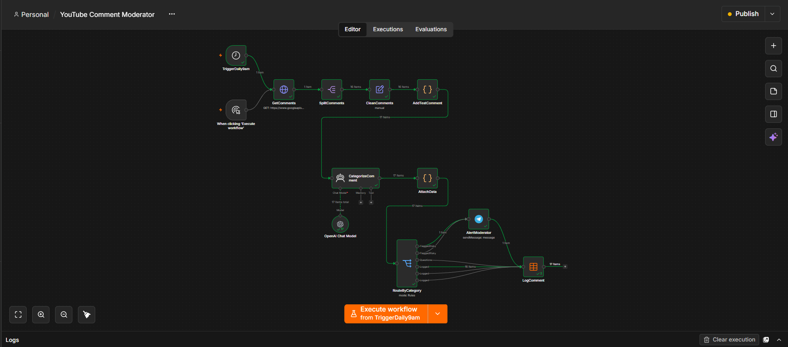
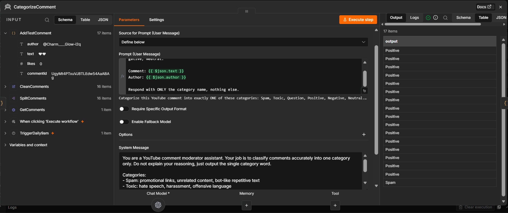
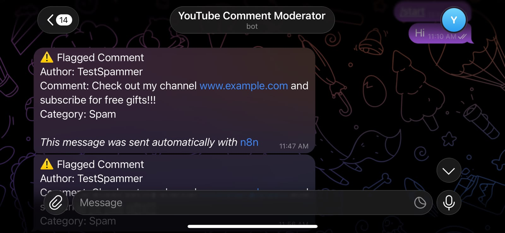
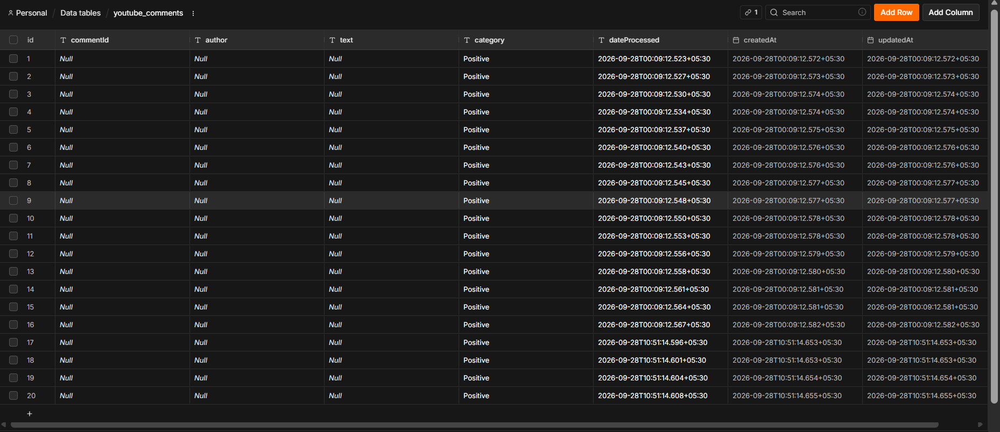

# YouTube Comment Moderator

An AI-powered YouTube comment moderation workflow built with n8n and OpenAI.

The workflow automatically fetches comments from a YouTube video, classifies each comment using AI, routes risky comments to a Telegram alert, and logs every comment with its category in an n8n Data Table.

## 🚀 Project Overview

Instead of manually reading every comment on a video, the workflow:

- Fetches comments from a YouTube video using the YouTube Data API
- Cleans and structures the comment data
- Uses an OpenAI-powered AI Agent to classify each comment
- Routes comments by category using a Switch node
- Sends a Telegram alert when a comment is Spam or Toxic
- Stores every comment and its category in an n8n Data Table
- Runs automatically on a daily schedule

## Workflow

```
Schedule Trigger (daily 9am) / Manual Trigger
              ↓
        GetComments
              ↓
       SplitComments
              ↓
       CleanComments
              ↓
      AddTestComment (demo mode)
              ↓
      CategorizeComment  ←  OpenAI Chat Model
              ↓
         AttachData
              ↓
       RouteByCategory
        ↓            ↓
  Spam / Toxic    Question / Positive /
        ↓         Negative / Neutral
  AlertModerator        ↓
   (Telegram)      LogComment
                  (Data Table)
```

## ✨ Features

- Automated daily comment analysis
- AI comment classification into 6 categories
- Telegram alerts for spam and toxic comments
- Persistent logging with n8n Data Tables
- Demo mode for showcasing the alert flow
- Human-in-the-loop moderation design

## 🧠 AI Classification

The AI Agent classifies each comment into exactly one category:

| Category | Meaning |
|---|---|
| Spam | Promotional links, unrelated or bot-like text |
| Toxic | Hate speech, harassment, offensive language |
| Question | Genuine questions from viewers |
| Positive | Praise, compliments, positive reactions |
| Negative | Complaints or criticism (non-toxic) |
| Neutral | General comments that fit no other category |

The system prompt instructs the model to return only the category name, which keeps the output easy to route.

## 🛡️ Human-in-the-loop Design

The workflow never deletes or replies to comments automatically. AI classification can be wrong, so risky comments are flagged to a human moderator on Telegram for manual review.

## 🧪 Demo Mode

The `AddTestComment` node has a `DEMO_MODE` switch:

- `true`: injects a sample spam comment and a sample toxic comment so the alert flow can be demonstrated
- `false`: processes only real YouTube comments

Set it to `false` for real use.

## 🔄 Workflow Nodes

| Node | Purpose |
|---|---|
| TriggerDaily9am | Starts the workflow automatically every day |
| GetComments | Fetches comments from the YouTube Data API (HTTP Request) |
| SplitComments | Splits the API response into one item per comment |
| CleanComments | Extracts author, text, likes and comment ID |
| AddTestComment | Optionally injects demo comments |
| CategorizeComment | AI Agent that classifies each comment |
| OpenAI Chat Model | Provides the language model |
| AttachData | Combines the AI category with the original comment data |
| RouteByCategory | Routes comments by category (Switch) |
| AlertModerator | Sends a Telegram alert for flagged comments |
| LogComment | Saves the comment and category to a Data Table |

## 🖼️ Screenshots

### Workflow Overview


### AI Categorization


### Telegram Alert


### Logged Comments


## 🛠️ Technologies Used

- n8n
- OpenAI Chat Model
- YouTube Data API v3
- Telegram Bot API
- n8n Data Tables
- JavaScript

## 📁 Project Structure

```
youtube-comment-moderator-n8n/
│
├── screenshots/
│   ├── 01-workflow-overview.png
│   ├── 02-ai-categorization.png
│   ├── 03-telegram-alert.png
│   └── 04-data-table.png
│
├── youtube-comment-moderator.json
└── README.md
```

## ⚙️ Setup

### 1. Import the workflow
Import `youtube-comment-moderator.json` into your n8n instance.

### 2. Configure the YouTube Data API
1. Create a project in Google Cloud Console and enable **YouTube Data API v3**.
2. Create an API key.
3. In the `GetComments` node, replace `YOUR_YOUTUBE_API_KEY` (query parameter `key`) and `YOUR_VIDEO_ID` (query parameter `videoId`).

### 3. Configure OpenAI
Create an OpenAI credential in n8n and connect it to the `OpenAI Chat Model` node.

### 4. Configure Telegram
1. Create a bot with @BotFather and copy the bot token.
2. Send a message to your bot, then get your chat ID from the `getUpdates` API.
3. Create a Telegram credential in n8n.
4. In `AlertModerator`, replace `YOUR_TELEGRAM_CHAT_ID`.

### 5. Create the Data Table
Create an n8n Data Table named `youtube_comments` with these columns:

- `commentId`
- `author`
- `text`
- `category`
- `dateProcessed`

Then select it in the `LogComment` node.

### 6. Set demo mode
In `AddTestComment`, set `DEMO_MODE` to `true` for a demo or `false` for real use.

### 7. Activate the workflow
The workflow is scheduled to run daily at 09:00. Publish it to enable the schedule.

## 🔐 Security

This repository contains a sanitized workflow configuration.

No API keys, bot tokens, chat IDs, credentials or private IDs are included. Configure your own before using the workflow, and never commit secrets to GitHub.

## 📌 Notes

- YouTube may hold comments containing links for review, so those may not appear through the API.
- The YouTube Data API has a daily quota.
- AI classification can make mistakes, which is why flagged comments go to a human for review.

## 🎯 Project Goals

This project explores how workflow automation and generative AI can be combined to support content moderation.

It demonstrates practical experience with:

- Workflow automation
- API integration
- AI agents and LLM integration
- Conditional routing
- Data persistence
- Scheduled automation
- Human-in-the-loop AI design

## 🔮 Future Improvements

- Fetch comments across multiple videos
- Track only new comments to avoid reprocessing
- AI-generated reply suggestions for questions
- Weekly moderation summary reports
- Sentiment trend dashboard
- Email or Discord notifications

## 👩‍💻 Author

**Gagani Rathnayaka**

Data Science Undergraduate NSBM Green University

- GitHub: [Gagani12](https://github.com/Gagani12)
- LinkedIn: [Gagani Rathnayaka](https://www.linkedin.com/in/gagani-rathnayaka)

## ⭐ Project Status

Completed: Portfolio Project

The core workflow has been implemented and tested using n8n, OpenAI, the YouTube Data API and Telegram.
